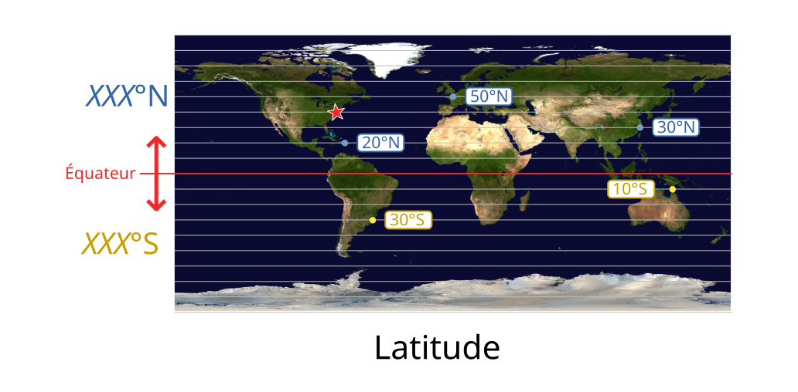
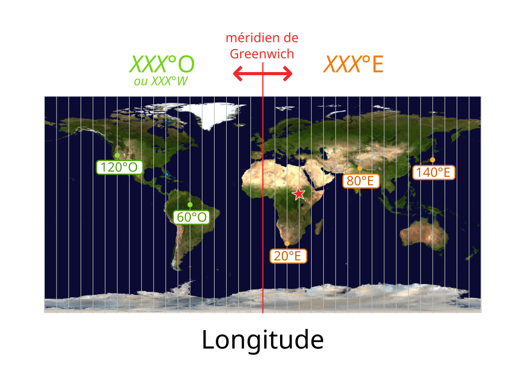
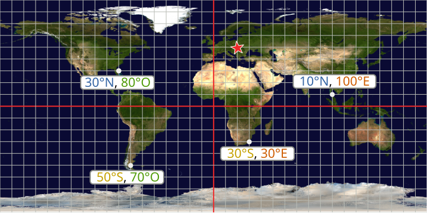

# Coordonnées géographiques

Pour positionner un point sur une carte,
on a besoin de ses **coordonnées géographiques**
([article Wikipédia](https://fr.wikipedia.org/wiki/Coordonn%C3%A9es_g%C3%A9ographiques)).
Elles sont constituées d'une **latitude** et une **longitude**.

## Latitude

La latitude d'un point sur la planète est constituée de :

- la distance à l'*équateur* en degrés (de 0° à l'équateur à 90° aux pôles) ;
- la lettre **N** si le point est au *nord* de l'équateur,
  la lettre **S** si il est au *sud*.

Dans le shéma suivant, il y a un trait horizontal tous les 10°.

### Question :

Donnez la **latitude** de l'étoile rouge :
<input id="lat1" type="number" size="3" step="10" min="0" max="180" title="Latitude">
</input>
°
<input id="lat2" type="text" size="1" maxlength="1" pattern="[sSnNeEwWoO]" title="Latitude">
</input>

<button onclick="validate(questions.latitude);">
Valider
</button>

## Longitude

La **longitude** d'un point sur la planète est constituée de :

- la distance au *méridien de Greenwich* en degrés (de 0° à 180°) ;
- la lettre **O** si le point est à l'*ouest* du méridien de Greenwich
  (ou **W** pour l'anglais *West*),
  la lettre **E** si il est à l'*est*.

Dans le shéma suivant, il y a un trait vertical tous les 10°.

### Question :

Donnez la **longitude** de l'étoile rouge :
<input id="lon1" type="number" size="3" step="10" min="0" max="180" title="Longitude">
</input>
°
<input id="lon2" type="text" size="1" maxlength="1" pattern="[sSnNeEwWoO]" title="Longitude">
</input>

<button onclick="validate(questions.longitude);">
Valider
</button>

## Coordonnées

Les coordonnées géographiques complètes d'un point sont constituées de
sa latitude suivie de sa longitude.

Exemples :

### Question :

Donnez les **coordonnées** de l'étoile rouge :
<input id="coordlat1" type="number" size="3" step="10" min="0" max="180" title="Latitude">
</input>
°
<input id="coordlat2" type="text" size="1" maxlength="1" pattern="[sSnNeEwWoO]" title="Latitude">
</input>
,
<input id="coordlon1" type="number" size="3" step="10" min="0" max="180" title="Longitude">
</input>
°
<input id="coordlon2" type="text" size="1" maxlength="1" pattern="[sSnNeEwWoO]" title="Longitude">
</input>

<button onclick="validate(questions.coordinates);">
Valider
</button>

On peut maintenant passer à la partie suivante : comment retrouver sa position
à partir de celles des satellites : 
<button onclick="nextSCO();">
Partie suivante : trilatération
</button>

