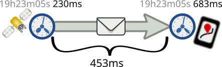
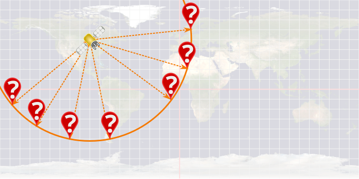
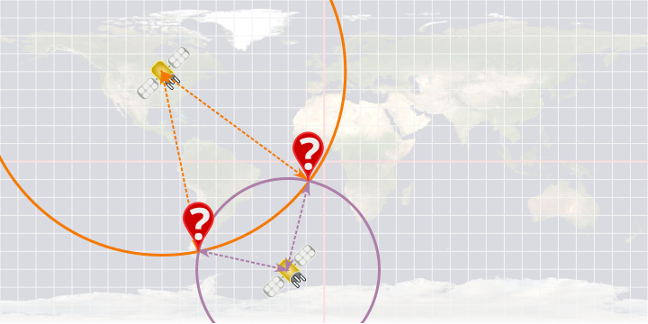
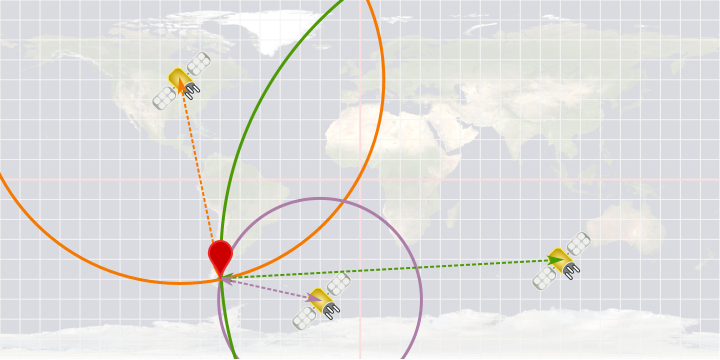

# Trilatération

La **trilatération** permet de déduire la position d'un point grâce à sa
distance avec 3 autres points dont on connaît déjà la position.
Dans le système GPS les satellites envoient régulièrement :

- leur coordonnées précises ;
- l'heure à laquelle ils envoient les données.

En recevant ces messages de 3 satellites ou plus, et en connaissant l'heure
précise de réception des messages, on peut retrouver notre position.

Voyons d'abord comment mesurer la distance qui nous sépare d'un satellite.

## Distance

Quand on reçoit un message d'un satellite on connaît :

- **l'heure précise d'envoi** du message, puisque le satellite la met dans le
  message et qu'il embarque une horloge atomique ;
- **l'heure précise d'arrivée** du message, à condition d'avoir une horloge
  bien à l'heure.

La différence entre ces 2 heures est le temps que le message à mis à parcourir
l'espace entre l'émétteur (le satellite) et le récepteur GPS.

Par exemple si un message est :

- envoyé à *19 heures 23 minutes 05 secondes et **230** millisecondes*
- reçu à *19 heures 23 minutes 05 secondes et **683** millisecondes*

Il aura mis 683 - 230 = 453 ms à arriver.

Comme le message est envoyé par onde radio, il se déplace à la vitesse de la
lumière, donc à peu près 300km/ms.

Dans notre exemple, on est donc à $453\times300=135900$ km du satellite.

### Question :

Si on reçoit le message d'un satellite :

- envoyé à *13 heures 37 minutes 42 secondes et **100** millisecondes*
- reçu à *13 heures 37 minutes 42 secondes et **200** millisecondes*

Donnez la **distance** (en km) qui nous sépare du satellite :

*(en considérant toujours que le message se déplace à 300km/ms)*

<input id="dist1" type="number" size="10" step="10" min="0" title="Distance en km">
</input>
km 
<button onclick="validate(questions.distance);">
Valider
</button>

## Trilatération

Si on connaît notre distance à **un seul** satellite, et les coordonnées de ce
satellite, on ne peut pas connaître notre position exacte, mais on sait qu'on
est sur le cercle qui a pour centre le satellite et pour rayon cette distance.

Par exemple ici on pourraît être n'importe où sur le cercle orange :

Si on connait la position et la distance à **2** satellites, il ne reste que
2 possibilités : les 2 points où les cercles se croisent.

Exemple :

Donc pour connaître notre position exacte on a besoin de **3 satellites**.
Les 3 cercles qui ont pour centre les satellites et pour rayon la distance
entre le satellite et le récepteur se croisent en un point aui est à la
position exacte du récepteur. Cette méthode s'appelle la **trilatération**.

Exemple :

En réalité dans le système GPS il y a toujours au minimum 4 satellites dont on
reçoit les message à tout moment : ça permet d'être plus précis, notamment si
on n'est pas sûr que l'horloge d'un appareil est suffisement précise.

### Question :

On veut trouver notre position grâce au système GPS. On capte les messages des 3 satellites
A, B, et C.

En comparant l'heure d'arrivée et de départ des messages reçus on en déduit que :

- **A** est à 216 ms de nous,
- **B** est à 201 ms de nous,
- **C** est à 223 ms de nous.

Grâce aux coordonnées contenues dans les messages des satellites, on a pu les
replacer sur une carte :

<canvas id="map" width="720" height="360">
</canvas>

Vous pouvez régler l'affichage des distances des satellites grâce aux
glissières suivantes :

Distance au satellite **A** : 
<input type="range" min="0" max="360" defaultValue="40" oninput="satslide(0, this.value);">
</input>
[40]{#satdstlabel0} ms.

Distance au satellite **B** : 
<input type="range" min="0" max="360" defaultValue="40" oninput="satslide(1, this.value);">
</input>
[40]{#satdstlabel1} ms.

Distance au satellite **C** : 
<input type="range" min="0" max="360" defaultValue="40" oninput="satslide(2, this.value);">
</input>
[40]{#satdstlabel2} ms.

Trouvez la position de notre récepteur GPS par **trilatération**.

Déduisez-en les **coordonnées géographiques** de notre récepteur :

*(Rappel : les lignes horizontales et verticales sont placées tous les 10°)*

<input id="coordlat1" type="number" size="3" step="10" min="0" max="180" title="Latitude">
</input>
°
<input id="coordlat2" type="text" size="1" maxlength="1" pattern="[sSnNeEwWoO]" title="Latitude">
</input>
,
<input id="coordlon1" type="number" size="3" step="10" min="0" max="180" title="Longitude">
</input>
°
<input id="coordlon2" type="text" size="1" maxlength="1" pattern="[sSnNeEwWoO]" title="Longitude">
</input>

<button onclick="validate(questions.coordinates);">
Valider
</button>

