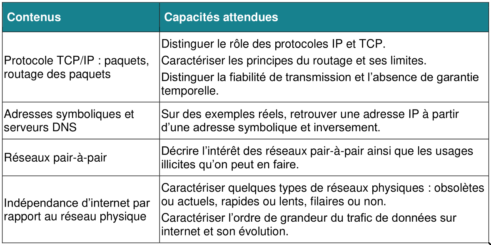

# Internet

## Attendus

# Protocoles TCP/IP, paquets, routage

## Histoire (10mn)

### Télécommunication

- difficile à dater : signaux de fumées, pigeons voyageurs
- 1794 : Télégraphe optique
- 1837 : Télégraphe électrique
- 1876 : téléphone

### Premiers réseaux informatiques

- 1950s : dévelloppement de l'informatique
- 1960s : premiers réseaux, à échelle locale
- 1969  : ARPANET, réseau à l'échelle des États Unis, ancêtre d'Internet

### Internet

- 1983 : les protocoles IP et TCP sont adoptés, ARPANET devient Internet
- 1992 : invention du Web (voir le thème correspondant du programme)
- fin 1990s : démocratisation de l'accès à Internet

## Activité : commutation de circuits (10mn)

Revenons un peu avant ARPANET, au temps des réseaux téléphoniques, des premiers réseaux informatiques.

Pour qu'un terminal soit relié à un autre il faut lui réserver un circuit connecté de bout en bout.

Une ligne ne peut être connectée qu'à une seule autre.

Les évenements suivants arrivent, essayez de connecter les lignes correspondantes, si il y a un problème, dites lequel :

* la ligne 1 à Cognac appelle la ligne 3 à Niort
* la ligne 2 à Angoulême appelle la ligne 2 à Cognac
* la ligne 6 à Cognac appelle la ligne 3 à Cognac
* la ligne 4 à Cognac appelle la ligne 1 à Poitiers
* la ligne 2 à Niort appelle la ligne 5 à Cognac
* la ligne 2 à Poitiers appelle la ligne 2 à Angoulême

### Quels sont les problèmes ? (5mn)

Problèmes à faire émerger :

* Si il n'y a plus de ligne disponible, on ne peut pas se connecter
* Un terminal ne peut pas être connecté à 2 autres
* Pendant une connexion, une ligne est réservée même si il n'y a pas de données échangées
* Soit il faut une vision globale du réseau, soit on réserve des bouts de lignes lentement avant m^eme de commencer à les utiliser

### Quelles solutions ? (5mn)

* Plus de câbles, mais c'est vite pas tenable
* Découper les messages en petits bouts : la commutation de paquets
  - revenir sur les raisons pour lesquelles ça peut résoudre les problèmes

## Activité : questions de routage (15mn)

* de quoi a-t-on besoin pour faire passer un message d'un terminal à l'autre ?
  - addresse source, destination, decoupage du message : c'est le protocole IP
* que doit faire un routeur quand il reçoit un message ?
  - le transmettre dans la "bonne direction", il doit avoir une idée de quel voisin sélectionner
* que faire si le réseau est encombré ? endommagé ? si des paquets tournent en boucle
  - stoquer les paquets, essayer d'autres chemins, jetter les paquets, leur donner un temps de vie maximal (TTL)
* que peut-il arriver aux paquets qui gênerait la communication ?
  - disparition, duplication, désordonnement
* quelles solutions à ces problèmes ?
  - numérotation, réenvoi : c'est le protocole TCP

Note : préciser la notion de "bonne direction" (table de routage comme "carte locale" du réseau)

## Classement des caractéristiques et rôles de TCP et IP

IP sert à transférer un paquet sur le réseau
il sert aux routeurs pour savoir quelle route faire prendre aux paquets,
mais ne regarde pas du tout le contenu.

TCP sert à garantir la fiabilité de la transmisson,
quel que soit le chemin que peut parcourir un paquet.

Classons les fonctionnalités et information de paquet suivants selon que ça appartienne à TCP ou à IP, ou aucun des 2.

IP:
- adresse destinataire
- adresse emetteur
- TTL (nombre de routeurs passés)
- routage
- taille du paquet

TCP:
- numérotation
- vérification des données
- réenvoi
- accusé de réception
- port (numéro de connexion / de serveur)
- gestion de la connexion

Aucun:
- contenu du paquet
- sécurisation de la transmission
- protocole du Web
- garantie que le paquet arrive à temps
